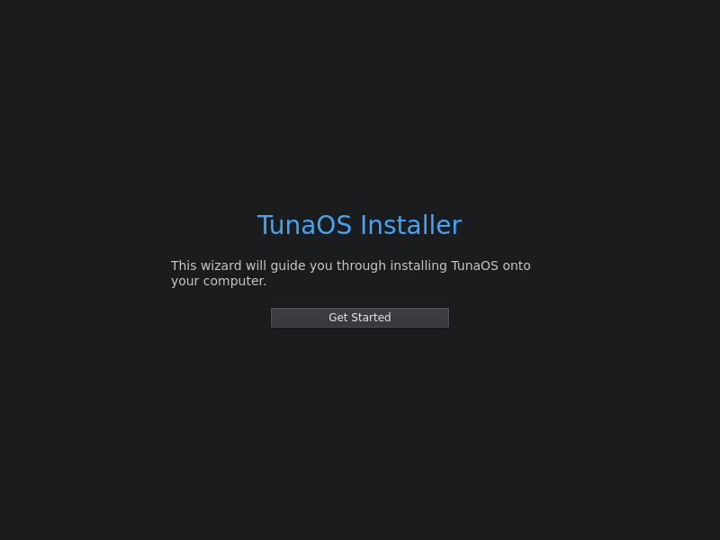
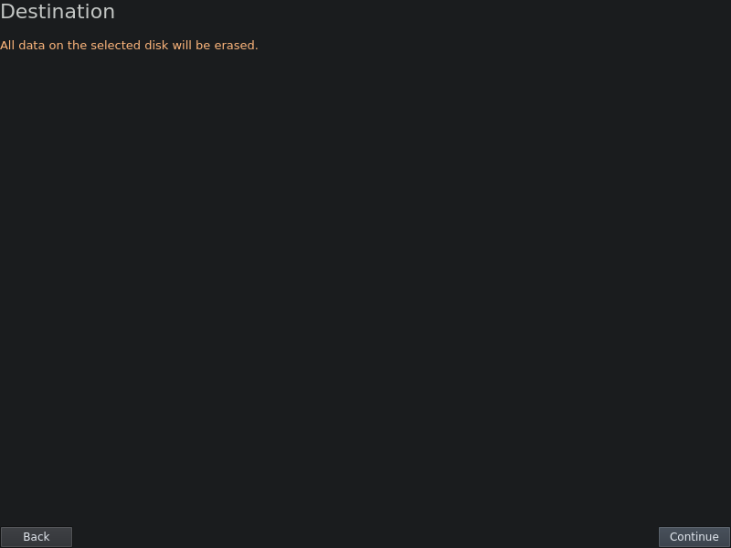
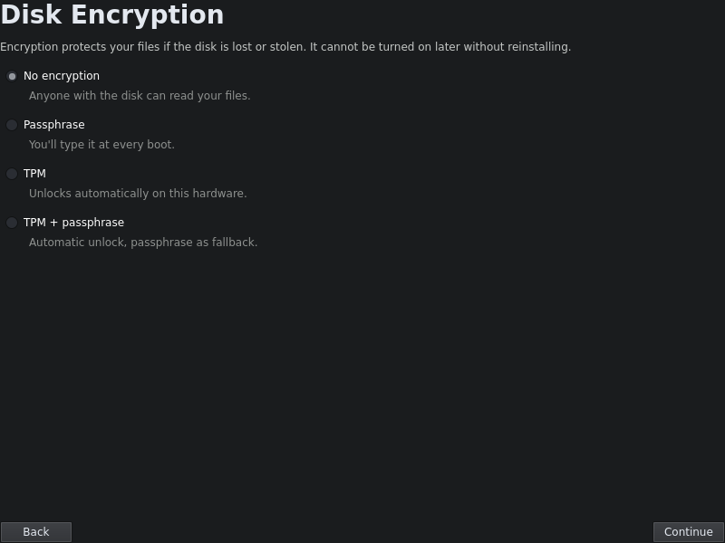
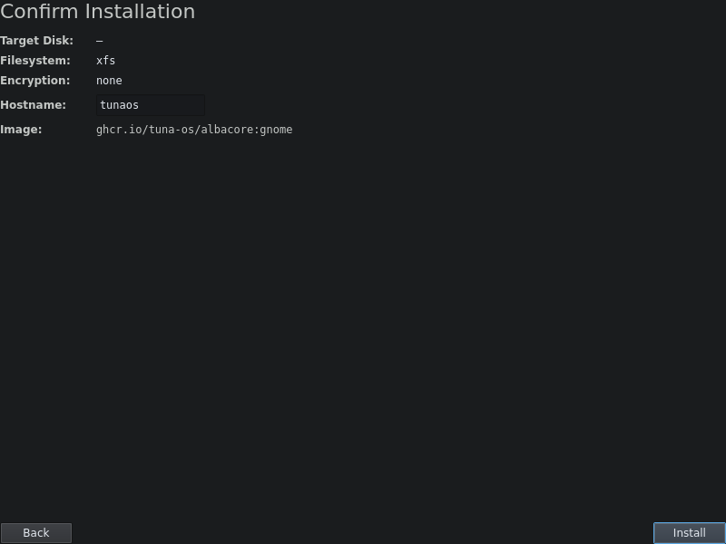
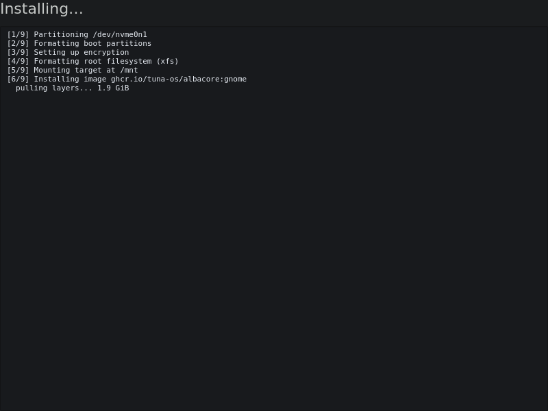
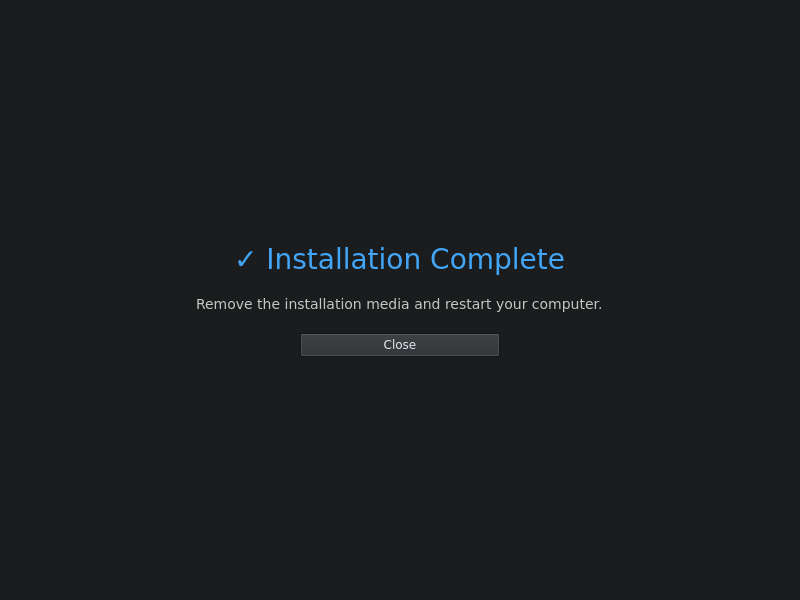

# The TunaOS niri installer — a walkthrough

Every image here is rendered in CI from the real `ui/installer.qml` by
`tests/gui/capture-screens.py`, so it cannot drift from the app.

**How this is possible without a compositor.** The installer normally runs under
[Quickshell](https://quickshell.org/) on niri, which is why it has been so hard
to look at. The capture loads the *same, unmodified* `installer.qml` under a
plain Qt Quick runtime by supplying local stub implementations of the two
Quickshell modules it imports (`tests/qml-stubs/`). The UI is real; only the
process-spawning backend is canned.

That stub is also a safety boundary: the real backend runs fisherman, which
partitions a disk. A stub that actually executed `command` would repartition
whatever machine rendered the docs.

---

## 1. Welcome



## 2. Choose a disk



Populated from `tuna-installer-niri discover-disks`, which parses `lsblk -J`.

## 3. Encryption



Encryption used to be hardcoded to `none` in the recipe with no UI at all, so
every install came out unencrypted (tuna-os/tunaOS#734). This screen is the fix.

## 4. Confirm



The last screen before anything is written.

## 5. Installing



Backend output streams into the log as it arrives.

## 6. Done



---

## Running the UI yourself, without niri

```sh
pip install PyQt6
python3 tests/gui/capture-screens.py /tmp/shots
```

Or load it interactively with the same stubs on `QML2_IMPORT_PATH`.
